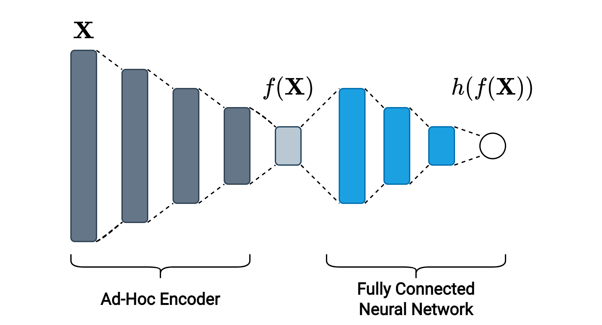

# About

The Autoencoder family of models has proven to be efficient in the construction of encoders that allow obtaining a lower dimensional representation that captures and encodes those hidden attributes that allow later reconstructing the input. However, these encodings do not consider the final task in which these representations will be used since the reduction is approached as an independent self-supervised problem. In the present research, **Fish** is proposed: a simple and novel neural architecture that allows to build an ad-hoc encoder to the supervised task.

The paper is available in docs/paper/main.pdf.

# Introduction

The following project was conducted for a master's course at Federico Santa María Technical University.

The idea came up to me in a class of **autoencoders**. I brought up the following questions:

1. Why should we train an autoencoder if a fully-connected neural network can also decrease dimensionality and in addition consider the supervised task?
2. Does the encoder recognize those latent attributes that are important for performing a supervised task?

After some discussion with the class, I decided to carry out this research.

# Results

In the experiments conducted, Fish outperform the setting of Autoencoder + ANN in most cases. Also, Fish is less computationally expensive.

# Tools

1. Python (Pandas, PyTorch)
4. Draw.io
5. LaTeX (MacTeX)
