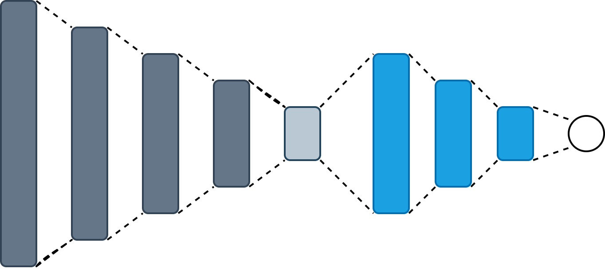
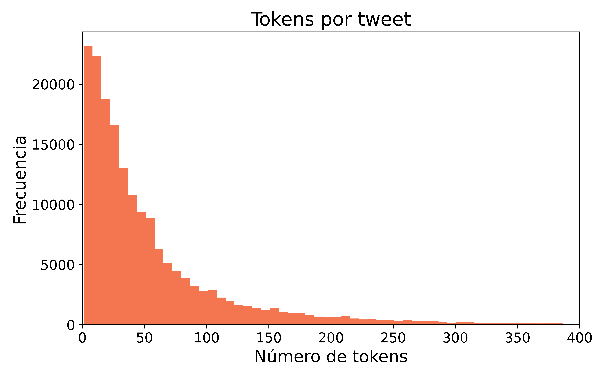
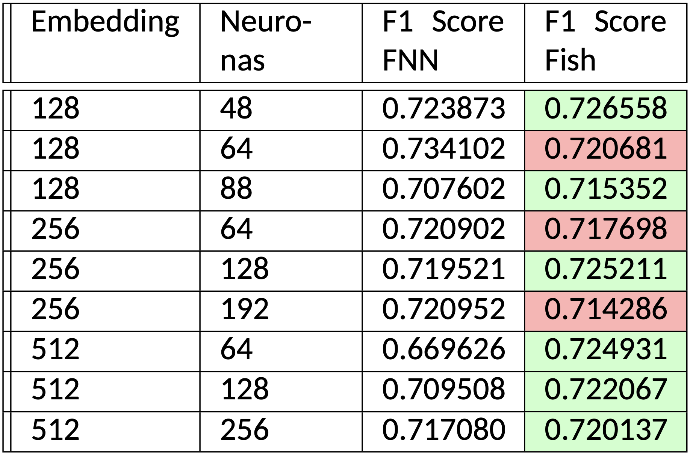

# **Encode What You Need**

## Fish Neural Network

> **Diego Quezada**
> **Universidad Técnica Federico Santa María**

---

## Motivación

- En el contexto de aprendizaje supervisado, se aprende una hipótesis $h \colon \mathcal{X} \rightarrow \mathcal{Y}$ utilizando un conjunto $\mathcal{S}$ de datos entrenamiento.
- Métodos actuales de reducción de dimensionalidad **no consideran la tarea final $h$** en la que se usará la representación de menor dimensionalidad.
- **Fish** aprende un codificador ***ad-hoc* a la tarea supervisada** que nos debería guiar hacia una mejor hipótesis $h$.
  

---

## Experimento

Comparar dos algoritmos:

1. Algoritmo 1: Entrenar **por separado** un *Autoencoder Undercomplete* y una red neuronal $(h_1 \circ f_1)(x)$ totalmente conectada que cuyas primeras capas están definidas por el codificador $f_1(x)$ con sus pesos congelados.
2. Algoritmo 2: Entrenar **simultaneamente** una red neuronal $(h_2 \circ f_2)(x)$ totalmente conectada cuyas primeras capas aprendan una representación de menor dimensionalidad.
3. Problema de clasificación: Identificar *tweets* tóxicos en inglés.

---

## Datos

- Conjunto de datos de 312735 *tweets* etiquetados como tóxicos o no tóxicos.
- Publicados en 2017 para una competencia en [Kaggle](https://www.kaggle.com/c/jigsaw-toxic-comment-classification-challenge) organizada por [*Jigsaw*](https://jigsaw.google.com/).
- Solo el 10% de los datos son tóxicos. Al crear los conjuntos de entrenamiento, validación y prueba, **se mantiene esta proporción**.

---

-  Cada *tweet* se mapeó a minúsculas y se tokenizó utilizando [Spacy](https://spacy.io/).
- Para evitar los problemas asociados a un conjunto de datos desbalanceado, se definió un *sampling* que permita obtener *batchs* de datos balanceados utilizando la clase [DataLoader](https://pytorch.org/docs/stable/data.html?highlight=dataloader#torch.utils.data.DataLoader) de **PyTorch**.

---

## Arquitecturas

1. Ámbas codifican la entrada utilizando 4 capas con activaciones *ReLU*.
2. Ámbas generan su salida utilizando 3 capas con activaciones *ReLU* seguidas de una capa con activación *Softmax*.
3. Los hiperpármetros de interés son el tamaño de *embedding* y el número de neuronas en la capa de expansión. 

---

## Entrenamiento

- Para entrenar el *Autoencoder* se utilizó la función de pérdida cuadrática para penalizar la reconstrucción de la entrada.
- Para entrenar $(h_1 \circ f_1)(x)$ se congelaron los pesos de $f_1$ y se utilizó la función de pérdida *Cross-Entropy* y el algoritmo de optimización *SGD*.
- Para entrenar $(h_2 \circ f_2)(x)$  se utilizó la función de pérdida *Cross-Entropy* y el algoritmo de optimización *SGD*.
- Los tres modelos se entrenaron durante 60 *epochs* y con un decaimento de la tasa de aprendizaje cada *20* epochs.

---

## Resultados

En la siguiente tabla se detalla el *F1-Score* obtenido en el conjunto de entrenamiento para cada configuración de hiperparámetros y arquitecturas.

> Solo para tres configuraciones, la arquitectura que utiliza un Autoencoder tiene un mejor F1-Score que Fish.

---

## Conclusiones

1. **Fish** supera, en general, al rendimiento de un modelo compuesto por un codificador de un *Autoencoder* seguido de una red neuronal artificial totalmente conectada.
2. Las codificaciones obtenidas mediante un *Autoencoder* **no necesariamente capturan los mejores atributos ocultos** para posteriormente, resolver un problema supervisado.
3. **Fish** requiere considerablemente un menor tiempo de computación para su entrenamiento sin sacrificar su rendimiento.
4. El siguiente paso para esta investigación es estudiar la calidad de la representaciones y analizar su capacidad para ser transferidas a problemas supervisados similares.